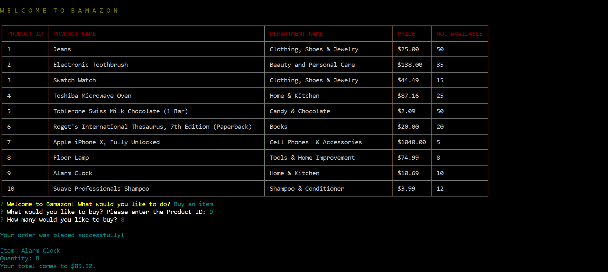
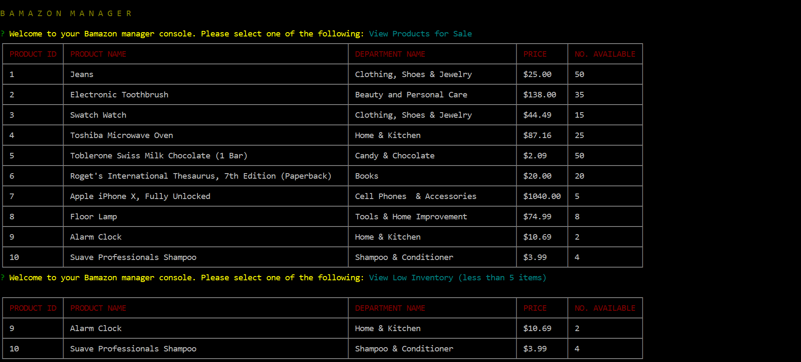

# Bamazon

# Project Description

Bamazon is an Amazon-like command line app that uses Node.js and MySQL. There are two functions in this application. The Customer View takes in orders from customers and depletes stock from the store's inventory. Product information can be seen in a table (product ID, product name, department name, price, and number available). Changes made when the customer buys a product are reflected in the product inventory list, as well as in MySQL. The Manager View allows managers to  view a list of the products for sale, view low inventory (a list of products with less than five available in stock), add to the inventory, and add a new product. Changes made in the Customer View (i.e. when a customer buys a product) are reflected in the table in the Manager View, as well as in MySQL.

# Technologies Used

* Node.js
* MySQL
* NPM packages:  MySQL, Inquirer, Cli-Table, and Colors

# Bamazon Demo

Since this is a command line application, there is no HTML page to see this app in action. To see the Bamazon application in action, watch the [Bamazon demo video](https://gcccd.instructuremedia.com/embed/a55099cc-763c-4eb7-a93f-41aeef574080).

# Screenshots

